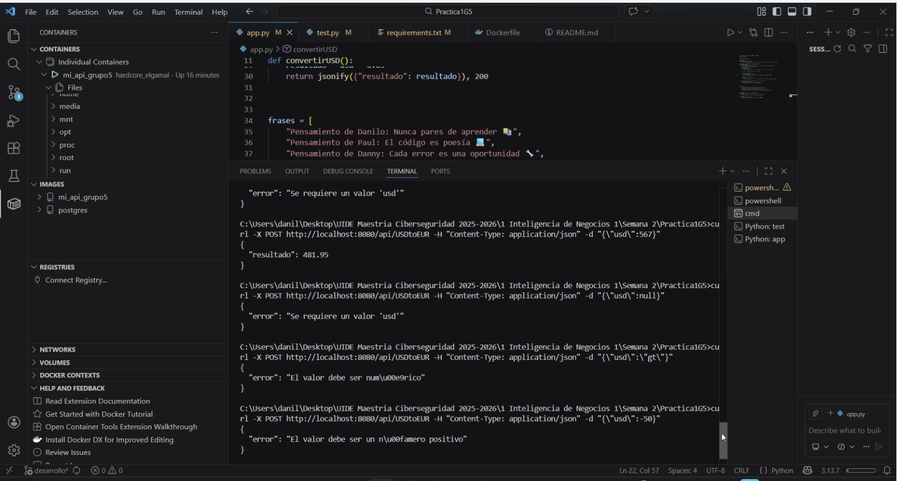
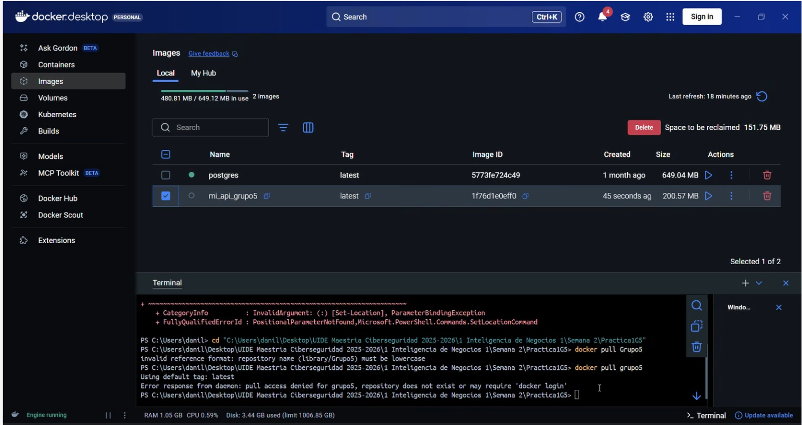
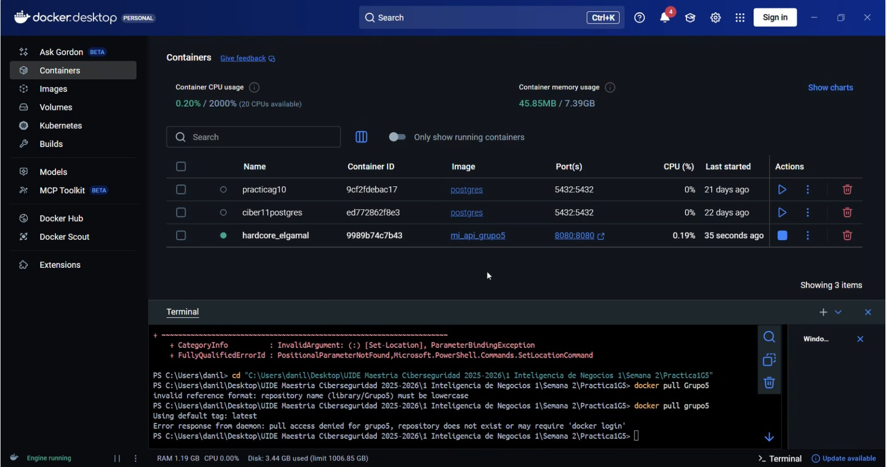
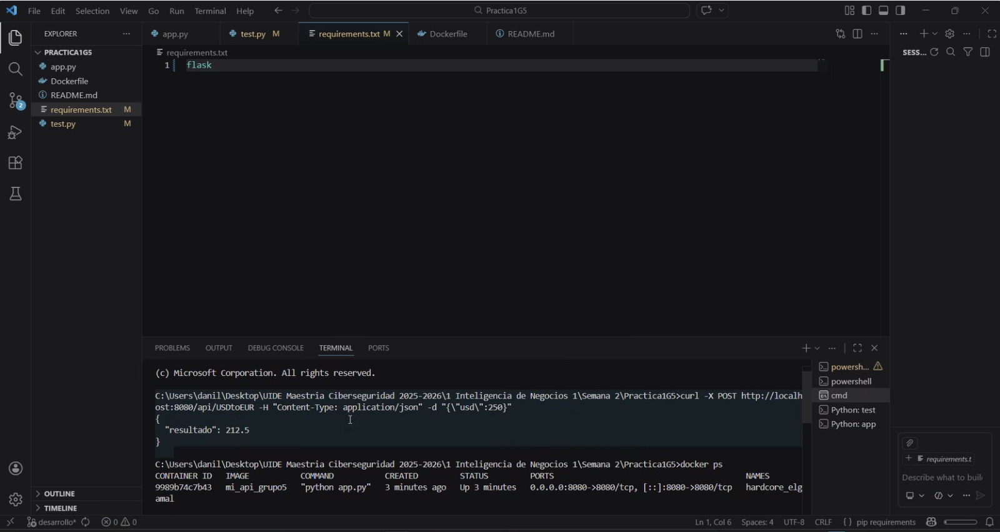
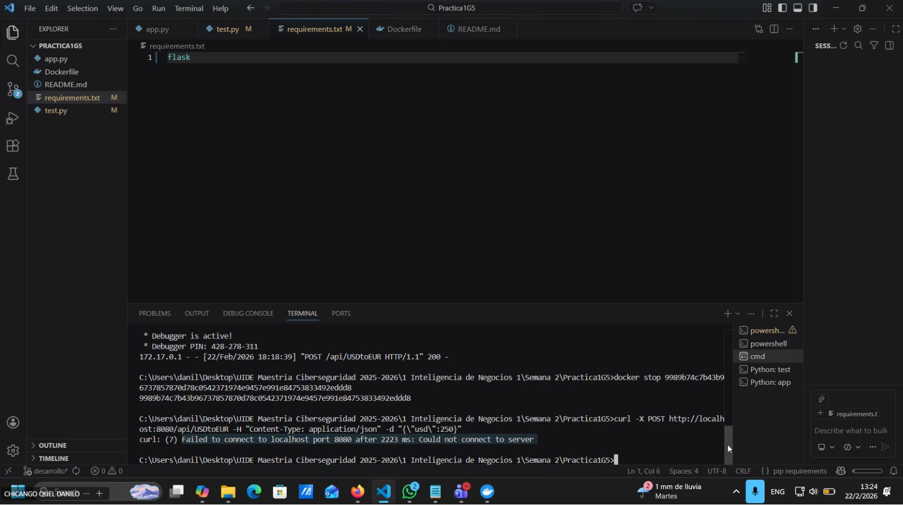
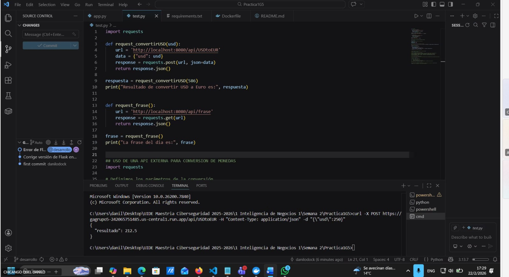
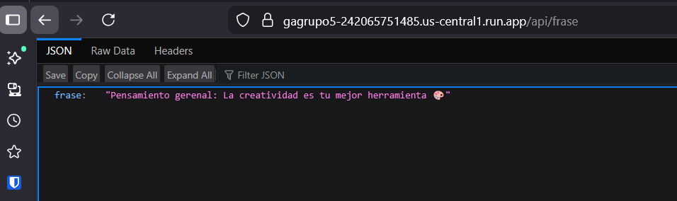

Estas son las evidencias de la practica:

- API funcionando localmente:

- Construcción de imagen Docker

- Contenedor ejecutándose

- Prueba curl exitosa

- API desplegada en Cloud

- Endpoint accesible públicamente

